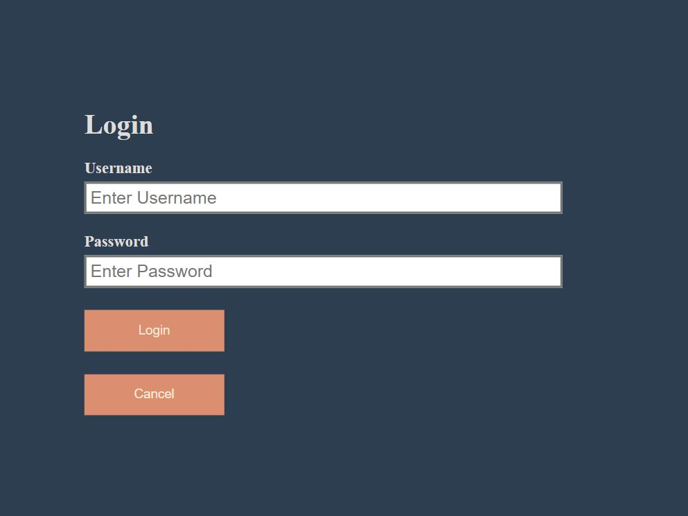
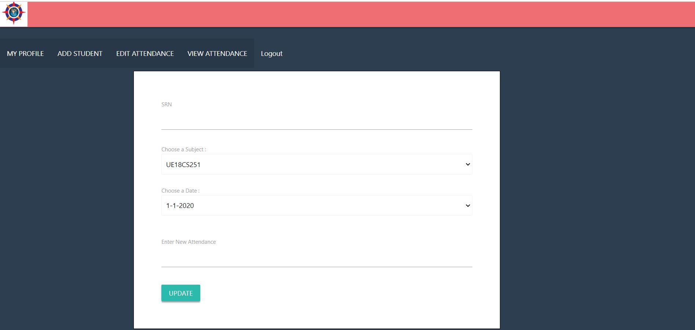
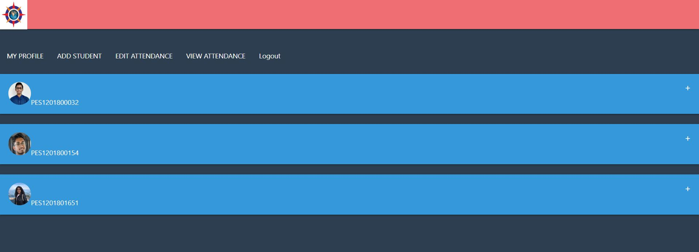
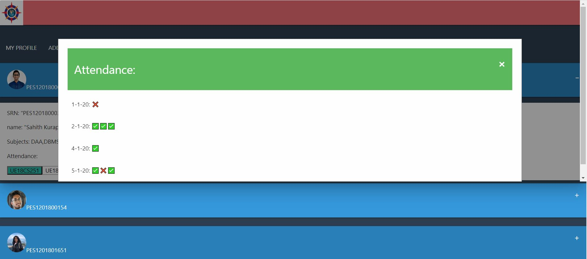

# automated-attendance-manager-web-app

### Introduction
This is the web app part of the complete automated attendance manager application.

### Screenshots of the app:

### Functionality of the web app:

* fully functioning login screen
* teacher profile page
* add student to database page
* update student attendance and details page
* view all students details page with detailed summary and attendance status

### Other part of the project:
The other part of the project (web app and face recognition) can be found [here](https://github.com/Sahith02/automated-attendance-manager-react-native).
